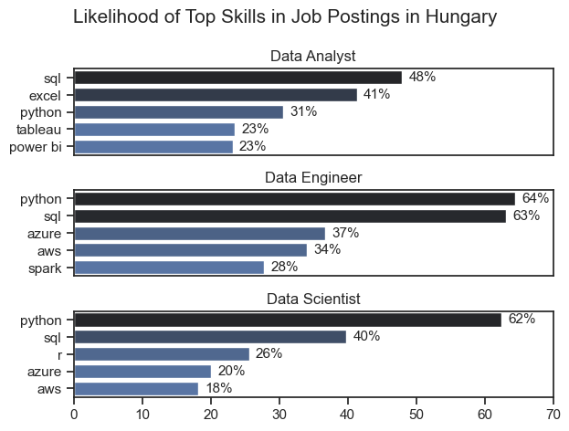
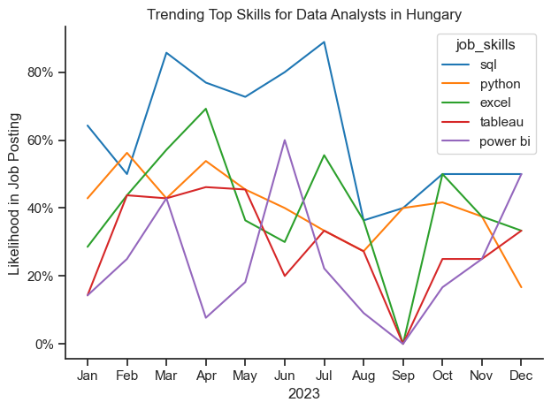
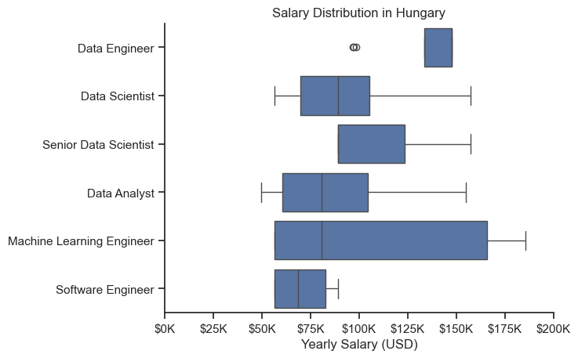
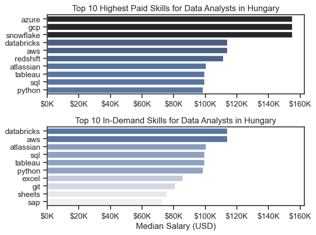
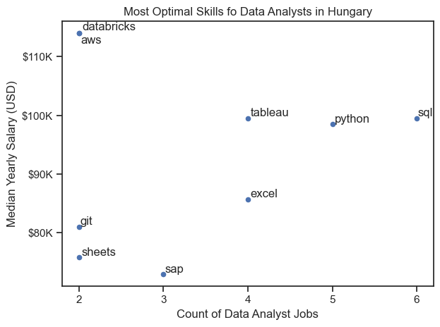
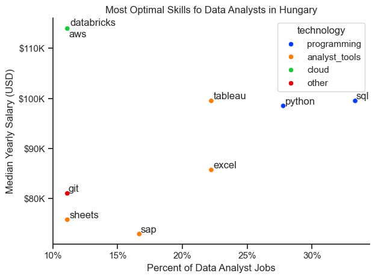

# Introduction
Welcome to my Python for Data Analytics capstone project! In this analysis, I aimed not only to showcase my skills in the Python programming language and its libraries essential for performing data analysis and visualization but also to explore the most sought-after and well-paid skills in the data job market so that aspiring analysts can go with their learning journey in the optimal direction.

The source of the data I've been working with is [Luke Barousse's Python for Data Analytics Course](https://www.lukebarousse.com/python). This data served as the base of my analysis, providing information about real-life job postings in the data job market, going into detail such as job titles, salary averages, countries and locations, and the skills listed in the postings. Using Python and its accompanying libraries for data analysis to process this data, I search for in-demand skills, look for salary trends, and find out where demand and high-pay meet.

# Background

Below are the questions about the Hungarian data job market I want to answer in my project:

1. What are the skills most in demand for the top 3 most popular data roles?
2. How are in-demand skills trending for Data Analysts?
3. How well do jobs and skills pay for Data Analysts?
4. What are the optimal skills for data analysts to learn? (High Demand AND High Paying)

# Tools I Used

For my deep dive into the data analyst job market, I harnessed the power of several key tools:

- **Python**: The backbone of my analysis, allowing me to analyze the data and find critical insights.I also used the following Python libraries:
  - **Pandas Library**: This was used to analyze the data.
  - **Matplotlib Library**: I visualized the data.
  - **Seaborn Library**: Helped me create more advanced visuals.
- **Jupyter Notebooks**: The tool I used to run my Python scripts which let me easily include my notes and analysis.
- **Visual Studio Code**: My go-to for executing my Python scripts.
- **Git & GitHub**: Essential for version control and sharing my Python code and analysis, ensuring collaboration and project tracking.

# The Analysis

## 1. What are the most demanded skills for the top 3 most popular data roles in Hungary?

In pursuit of the most in-demand skills for the three most popular data roles in Hungary, I filtered out and sorted the titles by which three were the most popular, and I found the five most sought-after skills for these roles. This query shows the top three job titles and their top skills, showing which skills one should pay attention to depending on their targeted role.

View my notebook with detailed steps here: [02_Skills_Demand.ipynb](3_Project/02_Skills_Demand.ipynb)

#### Visualize Data

```python
fig, ax = plt.subplots(len(job_titles), 1)

for i, job_title in enumerate(job_titles):
    df_plot = df_skills_perc[df_skills_perc['job_title_short'] == job_title].head(5)
    sns.barplot(data=df_plot, x='skill_percent', y='job_skills', ax=ax[i], hue='skill_percent', palette='dark:b_r')

plt.show()
```

#### Results



*Horizontal bar graphs visualizing the top 5 skills for the top 3 data roles*

#### Insights

- Python is a versatile skill, highly demanded across all three top roles, but most sought-after prominently for Data Engineers (64%) and Data Scientists (62%).
- SQL is the most or second most requested skill for all three data jobs, with it in nearly half the job postings for these titles.
- Both Data Engineers and Data Scientists require more specialized (AWS, Azure) compared to Data Analysts who are expected to be proficient in more general data management and analysis tools (Excel, Tableau, Power BI).

## 2. How are in-demand skills trending for Data Analysts?

I filtered the data set for Data Analyst positions and grouped the skills they mention by the month of the posting. With this, I got the top 5 skills of Data Analysts in Hungary by month which shows us how popular these skills were throughout the year 2023.

View my notebook with detailed steps here: [03_Skills_Trend.ipynb](3_Project/03_Skills_Trend.ipynb)

#### Visualize Data

```python
from matplotlib.ticker import PercentFormatter

df_plot = df_role_country_percent.iloc[:, :5]
sns.lineplot(data=df_plot, dashes=False, legend='full', palette='tab10')

plt.gca().yaxis.set_major_formatter(PercentFormatter(decimals=0))

plt.show()
```

#### Results



*Line graph visualizing the top skills for Data Analysts in Hungary in 2023*

#### Insights

- SQL stands out as the most consistently demanded skill throughout the year, with its likelihood in job postings mostly staying above 50% and peaking around 90% in certain months. This tells me SQL remains an essential skill for Data Analysts in Hungary.

- Skills like Excel, Tableau, and Power BI show variability in demand across the year. They all see a sharp decline in September but recover towards the end of the year.

- Python shows a relatively stable demand, typically between around 40%-50% throughout the year. Although it doesn't reach as high peaks as SQL, its steady presence suggests it is a key skill for data analysts, likely due to its versatility in data manipulation, analysis, and automation tasks. Python remains an essential tool in the data analyst's toolkit.

## 3. How well do jobs and skills pay for Data Analysts in Hungary?

To find out what the highest-paying roles and skills are I looked at job postings from Hungary and their median salary. In order to do that, first I explored the salary distributions of common data job postings to see what roles take home the highest pays.

View my notebook with detailed steps here: [04_Salary_Analysis.ipynb](3_Project/04_Salary_Analysis.ipynb)

#### Visualize Data

```python
sns.boxplot(data=df_country_top6, x='salary_year_avg', y='job_title_short', order=job_order)

plt.gca().xaxis.set_major_formatter(plt.FuncFormatter(lambda x, pos: f'${int(x/1000)}K'))

plt.show()
```

#### Results



*Box plot visualizing the salary distribution for the top 6 data job titles.*

#### Insights

- Most of these titles have a relatively compact salary distribution except Machine Learning Engineer, which seems to have a wider span salary range. Maybe it would be worth it to explore this role further and whether it can be divided into more specific titles.

- The median salaries seem to stay in the $65K - $85K range, except for Data Engineers. On the other hand, job postings with this role have the least variation and a few outliers in the lower values.

- Data Scientists and Data Analysts have very similar salary distributions. Although Data Scientists have a slightly higher upper quartile, suggesting that while these roles are closely aligned in pay, Data Scientists might have higher earning potential.

### Highest Paid & Most Demanded Skills for Data Analysts

#### Visualize Data

```python
fig, ax = plt.subplots(2, 1)

# Top 10 Highest Paid Skills for Data Analysts
sns.barplot(data=df_role_top_pay, x='median', y=df_role_top_pay.index, ax=ax[0], hue='median', palette='dark:b_r')

# Top 10 Most In-Demand Skills for Data Analysts
sns.barplot(data=df_role_skills, x='median', y=df_role_skills.index, ax=ax[1], hue='median', palette='light:b')

plt.show()
```
#### Results



*Two separate bar graphs visualizing the highest paid skills and most in-demand skills for data analysts in Hungary.*

#### Insights

- There is a noticeable overlap between the highest-paid skills and the most in-demand skills for Data Analysts in Hungary, particularly with skills like `Databricks`, `AWS`, `Atlassian`, and also **`Python`**. This suggests that skills which are both highly sought after by employers tend to command higher salaries, reflecting their critical importance in the industry.

- The top-paid skills for Data Analysts are dominated by cloud computing platforms like `Azure`, `GCP`, and `Snowflake`, indicating that expertise in these areas is highly valued in the Hungarian data job market. These technologies are essential for handling large-scale data, which explains their premium in salaries.

- While some skills such as `Databricks` and `AWS` are both high-paying and in-demand, others like `Excel` and `Sheets`, although still in demand, do not feature among the highest-paid skills. This suggests that while basic data manipulation tools remain important, they do not provide the same salary leverage as more specialized technologies, indicating a potential area for skill development for those looking to increase their earning potential.

## 4. What are the most optimal skills to learn for Data Analysts?

To identify the most optimal skills to learn (the ones that are the highest paid and highest in demand) I calculated and percent of skill demand and the median salary of these skills in Hungary. To easily identify which are the most optimal skills to learn I visualized this data using scatter plots.

View my notebook with detailed steps here: [05_Optimal_Skills.ipynb](/3_Project/05_Optimal_Skills.ipynb)

#### Visualize Data

```python
from adjustText import adjust_text
from matplotlib.ticker import PercentFormatter

sdf_role_skills_high_demand.plot(kind='scatter', x='skill_count', y='median_salary')

plt.show()
```

#### Results



*A scatter plot visualizing the most optimal skills (high paying & high demand) for data analysts in Hungary.*

#### Insights

- The skills `Databricks` and `AWS` appears to have the highest median salary of oveer $110K, despite being amongst the least common in job postings. This suggests high value placed on specialized database skills within the data analyst profession.

- More commonly required skills like `Excel` has a better presence in job listings but lower median salaries compared to specialized skills like `Tableau`, **`Python`** and `SQL`. **`Python`** does not only have higher salaries but are also moderately prevalent in job listings.

### Visualizing Different Techonologies

Let's visualize the different technologies as well in the graph. We'll add color labels based on the technology (e.g., {Programming: Python})

#### Visualize Data

```python
from matplotlib.ticker import PercentFormatter

# Create a scatter plot
scatter = sns.scatterplot(
    data=df_role_skills_tech_high_demand,
    x='skill_percent',
    y='median_salary',
    hue='technology',  # Color by technology
    palette='bright',  # Use a bright palette for distinct colors
    legend='full'      # Ensure the legend is shown
)
plt.show()
```
#### Results



*A scatter plot visualizing the most optimal skills (high paying & high demand) for data analysts in Hungary with color labels for technology.*

#### Insights

- The scatter plot shows that programming skills, specifically `SQL` and **`Python`**, are highly valued in the data analysis field, with `SQL` being the most demanded and having a median salary of about $100K. This highlights the critical role of programming in data-related roles, with `SQL` being slightly more prevalent, likely due to its essential use in database management.

- Cloud technologies, particularly `Databricks` and `AWS`, have the highest median salaries at above $110K, despite a lower demand. This suggests that while these skills are less commonly required compared to others, they are highly specialized and therefore command a premium in the job market, reflecting the growing importance of cloud-based solutions in data analytics.

- Tools like `Tableau`, `Excel`, and `SAP` are frequently used in the data analysis process, as indicated by their demand, but they generally offer lower median salaries compared to programming and cloud technologies. While these tools are essential for day-to-day data analysis tasks, the lower salary range suggests that proficiency in these tools alone may not be enough to reach higher-paying roles without the addition of more specialized technical skills.

# What I Learned
Throughout this project, I deepened my understanding of the data analyst job market and enhanced my technical skills in Python, especially in data manipulation and visualization. Here are a few specific things I learned:

- **Advanced Python Usage**: Utilizing libraries such as Pandas for data manipulation, Seaborn and Matplotlib for data visualization, and other libraries helped me perform complex data analysis tasks more efficiently.

- **Data Cleaning Importance**: I learned that thorough data cleaning and preparation are crucial before any analysis can be conducted, ensuring the accuracy of insights derived from the data.

- **Strategic Skill Analysis**: The project emphasized the importance of aligning one's skills with market demand. Understanding the relationship between skill demand, salary, and job availability allows for more strategic career planning in the tech industry.

# Key Insights
This project provided several general insights into the data job market for analysts:

- **Consistency and Prevalence of Programming Skills**: SQL and Python are consistently demanded across various data roles, with SQL being the most sought-after, appearing in nearly half of all job postings and often associated with higher salaries. **Python**, while slightly less prevalent, remains a key skill due to its versatility in data manipulation and analysis, making it essential for data professionals.

- **Market Trends**: There are changing trends in skill demand, highlighting the dynamic nature of the data job market. Keeping up with these trends is essential for career growth in data analytics.

- **Economic Value of Skills**: Understanding which skills are both in-demand and well-compensated can guide data analysts in prioritizing learning to maximize their economic returns.

# Challanges
This project was not without its challenges, but it provided good learning opportunities:

- **Data Inconsistencies**: Handling missing or inconsistent data entries requires careful consideration and thorough data-cleaning techniques to ensure the integrity of the analysis.

- **Complex Data Visualization**: Designing effective visual representations of complex datasets was challenging but critical for conveying insights clearly and compellingly.

- **Balancing Breadth and Depth**: Deciding how deeply to dive into each analysis while maintaining a broad overview of the data landscape required constant balancing to ensure comprehensive coverage without getting lost in details.

- **Sample Size**: It was also challenging to customize the course's project for Hungary, since there aren't nearly as many data jobs listed compared to the US, and even less without missing salary data.

# Conclusion
This exploration into the data analyst job market has been incredibly informative, highlighting the critical skills and trends that shape this evolving field. The insights I got enhance my understanding and provide actionable guidance for anyone looking to advance their career in data analytics. As the market continues to change, ongoing analysis will be essential to stay ahead in data analytics. This project is a good foundation for future explorations and underscores the importance of continuous learning and adaptation in the data field.